# FnSync - Sync with Your Windows

FnSync provides you with:

1. Notification Synchronization, from phone to Windows PCs.
2. Clipboard Synchronization (Bidirectional, Text Only).
If you use Android 10 or above, you can also send text to PC through system text selection menu and share menu.
3. Lock PCs' screen when you unplug your phone.
4. File transfer.

Download: https://gitee.com/holmium/fnsync/releases

Currently only Windows 10 is supported. Windows 11 may also be fine (not tested).

Requires an Android Companion APP installed on your phone. Link: https://play.google.com/store/apps/details?id=holmium.fnsync

# Screenshot

## Connecting

QR、Connection Code（For devices without camera）

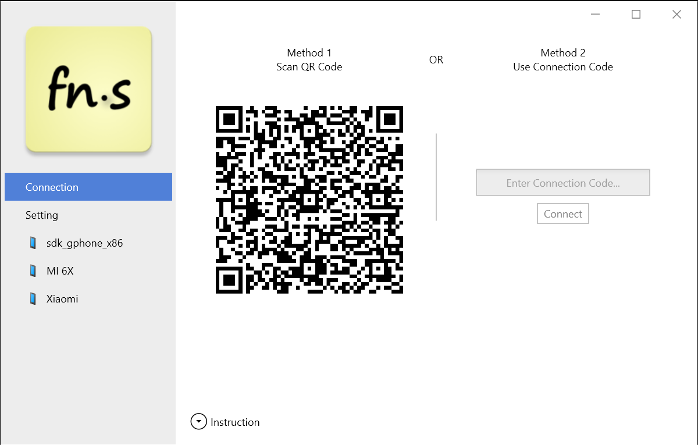

## Notification Synchronization

You can copy the whole text or URLs/numbers

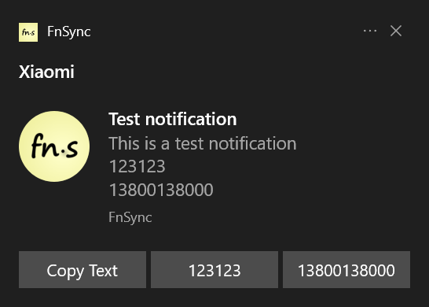

## Black/White List for Notification Synchronization

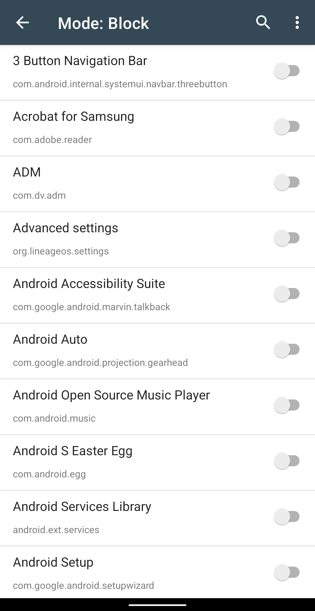

## File Manager

Cut, copy and transfer files & folders

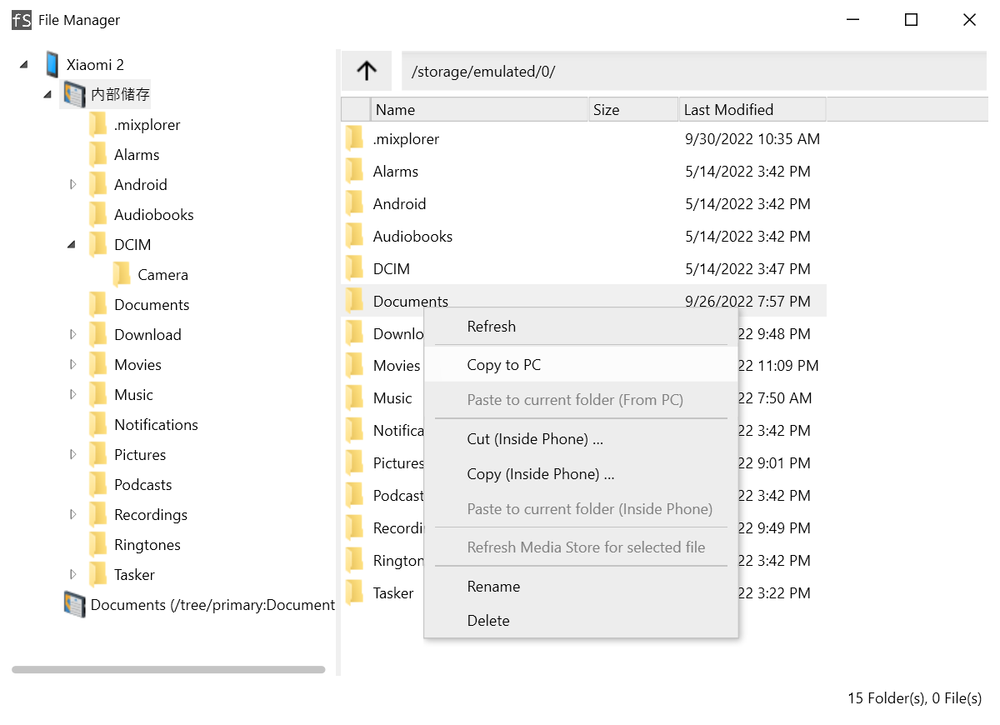

## File Transfer

Supports resume after break

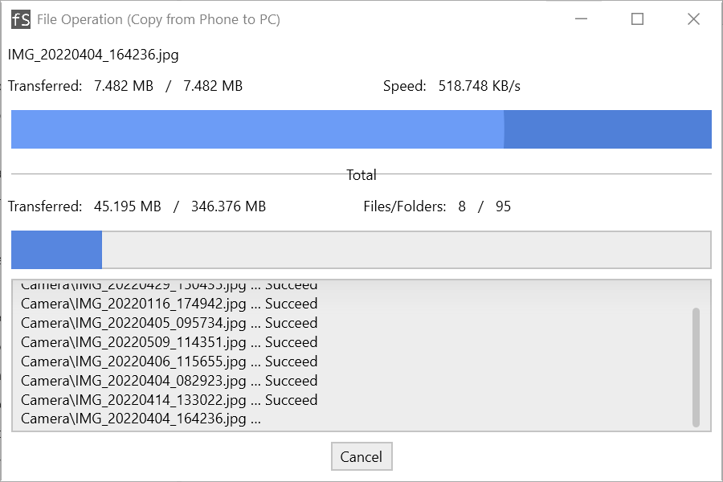

## Send File to PC

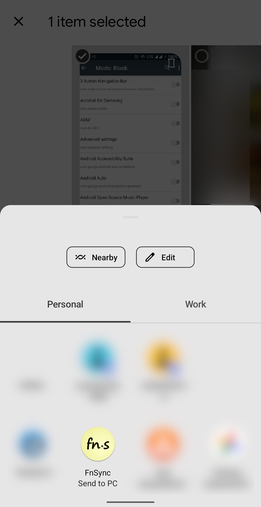

## Settings

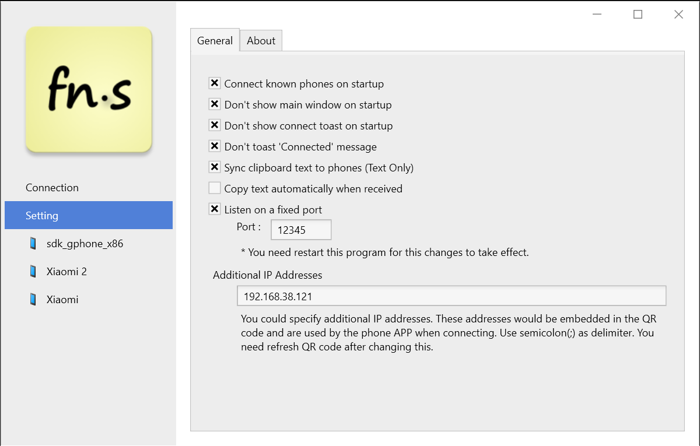

## Phone Status

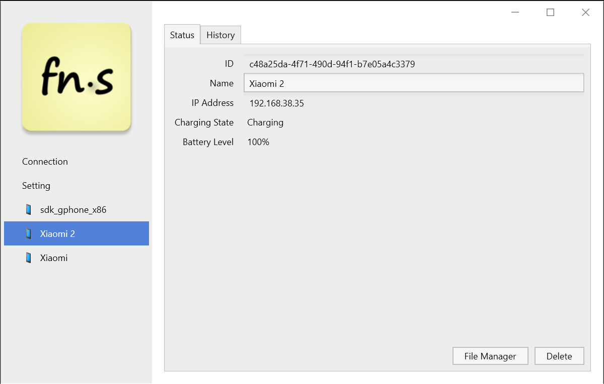

# FnSync - 与电脑同步

本软件提供的功能有：

1. 手机通知同步至电脑； 
2. 剪切板同步（仅文本，双向）；
针对 Android 10 及以上版本的系统，可以通过系统文本选择菜单和分享菜单发送文本到电脑。 
3. 手机控制电脑锁屏；
4. 文件管理和文件传输功能；
5. 分享手机文件到电脑；

下载地址：https://gitee.com/holmium/fnsync/releases

目前仅支持 Windows 10。

此软件需结合 Android 端 APP 一起使用。Android 端 APP 的地址是：https://www.coolapk.com/apk/269031 或者 https://play.google.com/store/apps/details?id=holmium.fnsync

用户交流QQ群：`246938957`

# 功能介绍

## 连接

二维码连接、连接码（适用于无摄像头设备）

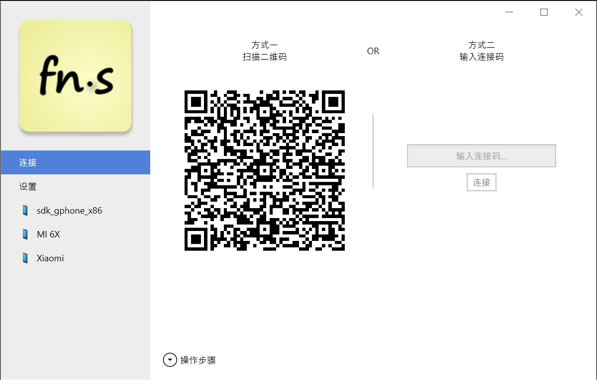

## 通知同步

可直接复制文本、验证码、URL

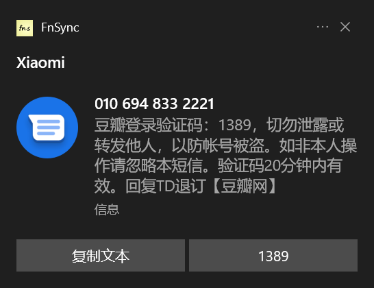

## 通知同步应用黑、白名单

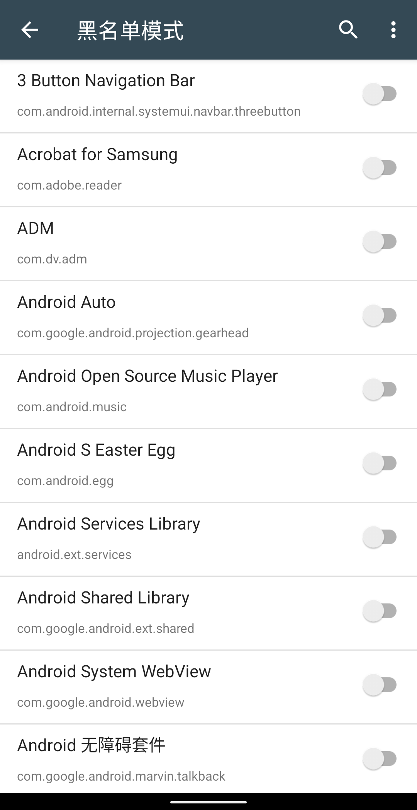

## 文件管理器

手机内移动、复制。手机与电脑文件传输

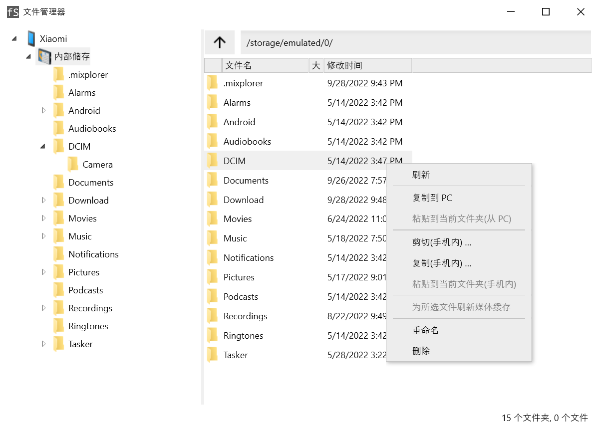

## 文件传输

支持断点续传

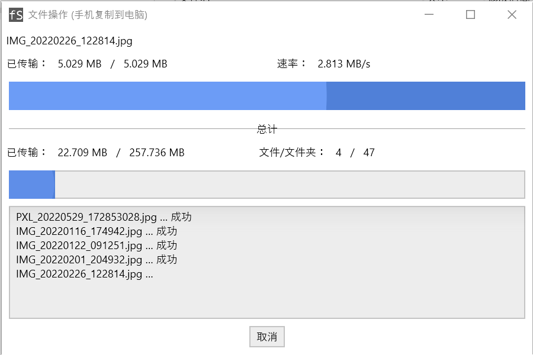

## 发送文件到电脑

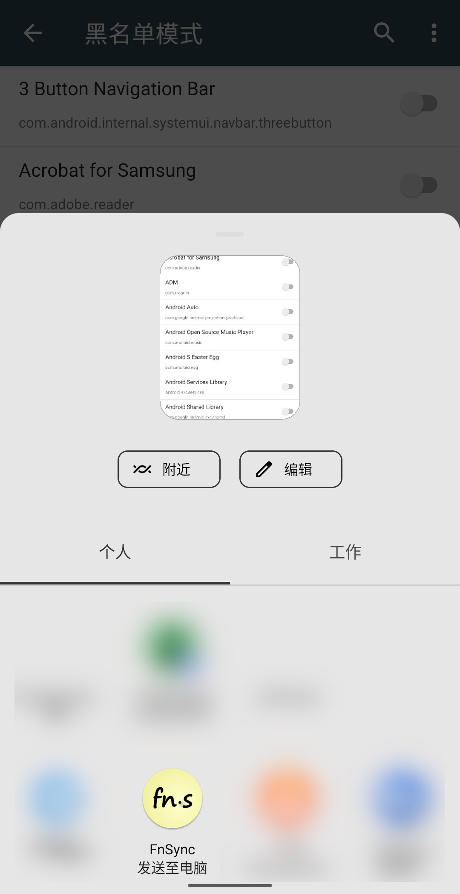

## 直接从微信发送

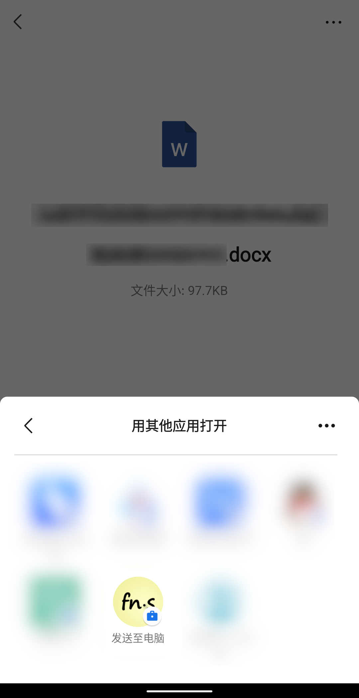

## 设置

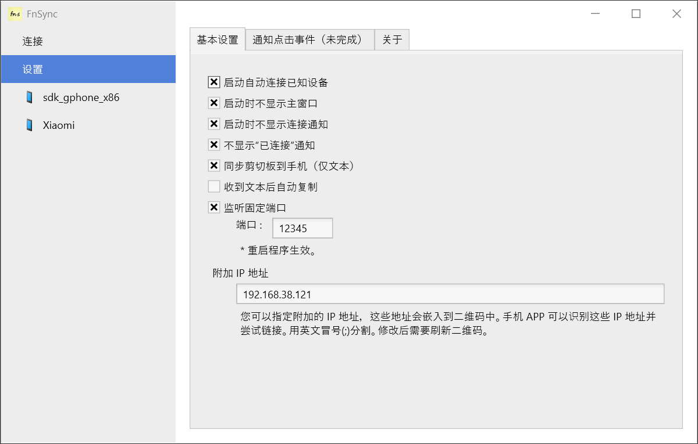

## 手机状态

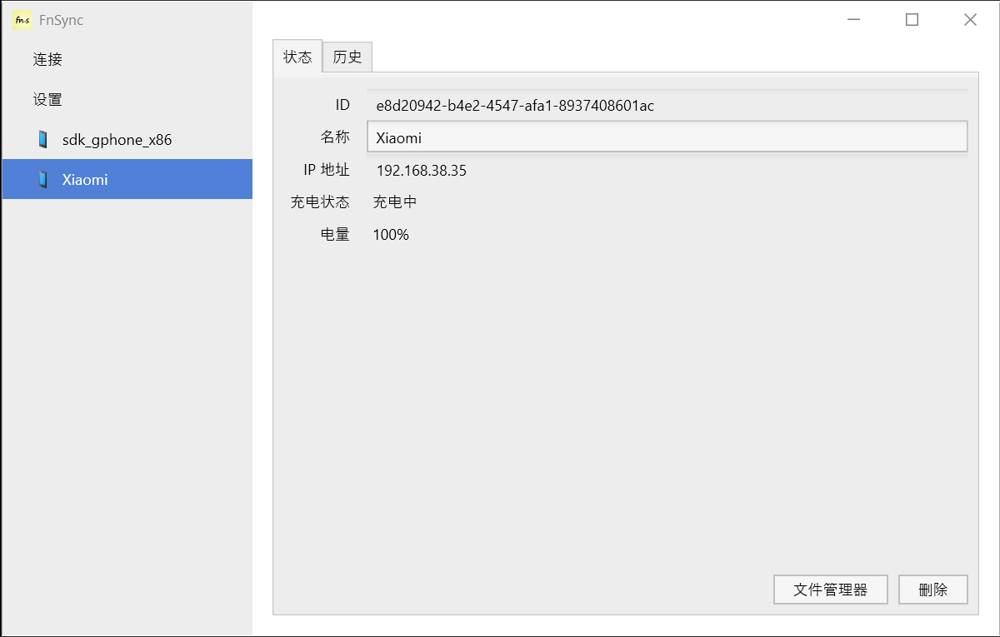

# 其他链接

* [FnSync – 同步 Android 通知到 Windows，双向同步剪贴板，还能拔掉手机电源后锁定电脑](https://www.appinn.com/fnsync/)
* [手机和电脑的无缝同步神器](https://mp.weixin.qq.com/s/sqJca-LAbzvEYOLNPIIMHg)
* [几近完美的手机电脑无缝共享剪贴板神器，终于被我找到了](https://mp.weixin.qq.com/s/7TURBbxn9aSG7LqJRiFoDQ)
* [这款国产良心软件，解决了无数人头疼的问题](https://www.leikeji.com/article/51365)
* [这个小玩意让手机的推送无缝显示在电脑上](https://www.jianshu.com/p/243c3474ce96)
